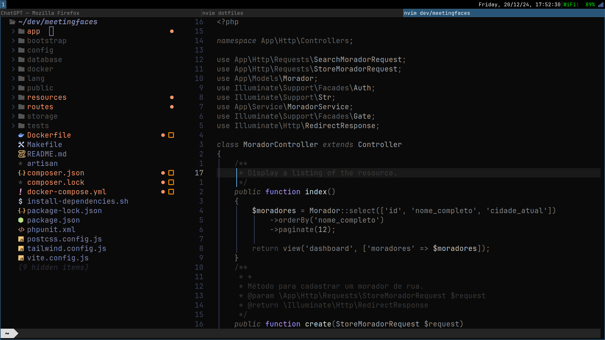
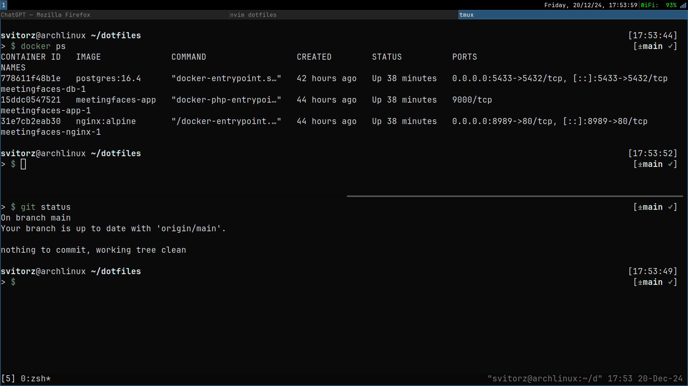

# Dotfiles

Este repositório contém meus arquivos de configuração pessoais (**dotfiles**) para diversas ferramentas e aplicativos no meu ambiente de desenvolvimento.

## Estrutura do Repositório

Os principais diretórios e arquivos neste repositório incluem:

- **alacritty/**: Configurações para o terminal Alacritty.
- **i3/**: Configurações para o gerenciador de janelas i3.
- **i3status/**: Configurações para a barra de status i3status.
- **neovim/**: Configurações para o editor de texto Neovim.
- **tmux/**: Configurações para o multiplexador de terminais tmux.
- **zsh/**: Configurações para o shell Zsh.

## Pré-requisitos

- **Sistema Operacional**: Linux (testado no Arch Linux).
- **Gerenciador de Pacotes**: `pacman` (nativo do Arch Linux) e/ou AUR helpers (por exemplo, `yay`).
- **Ferramentas Utilizadas**:
  - **Neovim**: Configurado com LazyVim e Phpactor.
  - **Pavucontrol**: Para controle de volume.
  - **Alacritty**: Terminal com fonte JetBrains Mono.
  - **i3**: Gerenciador de janelas.
  - **tmux**: Multiplexador de terminais.
  - **Zsh**: Shell com Oh My Zsh e plugins personalizados.
## Personalizações

- **Tema do Terminal**: Utiliza a fonte JetBrains Mono para melhor legibilidade.
- **Neovim**: Configurado com LazyVim como base, incluindo suporte ao Phpactor para desenvolvimento em PHP.
- **i3**: Configurações otimizadas para um fluxo de trabalho eficiente no Arch Linux.
- **Zsh**: Configurado com Oh My Zsh e plugins personalizados para aprimorar a produtividade no terminal.

## Screenshots

## Contribuição

Sinta-se à vontade para enviar pull requests ou abrir issues com sugestões e melhorias. Toda contribuição é bem-vinda!

## Licença

Este projeto está licenciado sob a licença MIT. Consulte o arquivo [LICENSE](LICENSE) para mais informações.

---

Para mais informações sobre como gerenciar e personalizar seus dotfiles, você pode assistir ao seguinte vídeo:

 
